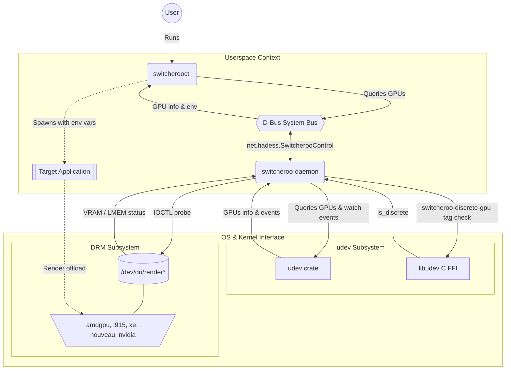

## Switcheroo Rust Port

A Rust port of the original [switcheroo-control daemon and CLI tool](https://gitlab.freedesktop.org/hadess/switcheroo-control) by [Bastien Nocera](https://gitlab.freedesktop.org/hadess).

From a [switcheroo-control man page](https://linuxcommandlibrary.com/man/switcheroo-control):

> switcherooctl is the command-line interface for switcheroo-control, a daemon that manages hybrid graphics on Linux laptops with multiple GPUs. It provides a simple way to list available graphics adapters and launch applications on a specific GPU.
> 
> On hybrid graphics systems with both integrated (power-efficient) and discrete (high-performance) GPUs, applications default to the integrated GPU. Using switcherooctl, you can run specific applications on the discrete GPU for better graphics performance.

This port uses the [`udev` crate](https://github.com/Smithay/udev-rs) for GPU monitoring, combined with the [`nix` crate](https://github.com/nix-rust/nix) for low-level ioctl driver queries (amdgpu, i915, nouveau, and xe drivers) to determine whether a card is discrete or integrated.

It reimplements the standard `net.hadess.SwitcherooControl` interface using the [`zbus` crate](https://github.com/z-galaxy/zbus). 

`switcherooctl` provides a user-friendly CLI via the [`clap` crate](https://github.com/clap-rs/clap), including implicit subcommands which are also present in the original project. The daemon likewise uses `clap` for its own `--replace` flag.

Also, just like the original project, it includes a regex-based cleanup module to prettify GPU information before it is published over D-Bus

### Workspace Members

| Crate               | Description                                                                |
| ------------------- | -------------------------------------------------------------------------- |
| `switcheroo-daemon` | Background system service that monitors hardware and exposes it over D-Bus |
| `switcherooctl`     | CLI utility used to list GPUs and launch binaries using a specific GPU     |
| `switcheroo-common` | Shared types, serialization/deserialization logic and D-Bus definitions    |

### Architecture



### Usage

Ensure you have the `libudev` library installed where it can be found by `pkg-config`. 

Example:

```bash
sudo apt-get install libudev-dev    # Debian-based Linux distributions
sudo zypper install systemd-devel   # openSUSE/SLE
```

Compile a release build using [Cargo](https://rustup.rs/):

```bash
cargo build --release
```

To test the daemon locally, stop the existing system service first to avoid D-Bus conflicts:

```bash
sudo systemctl stop switcheroo-control
sudo ./target/release/switcheroo-daemon
```

> [!TIP]
> The daemon supports a `--replace` flag to replace an already running instance. 
> Without it, the daemon will exit immediately if another instance holds the bus name.

You can now use the CLI tool:

```bash
./target/release/switcherooctl help
```

```bash
Usage: switcherooctl [OPTIONS] [COMMAND]

Commands:
  list    List the known GPUs
  launch  Launch a command on a specific GPU
  help    Print this message or the help of the given subcommand(s)

Options:
  -g, --gpu <GPU>
  -h, --help       Print help
```

### Example

Launch the glmark2's refract benchmark on a discrete GPU:

```bash
./target/release/switcherooctl launch --gpu 1 glmark2 -b refract
```

For simplicity, you can also omit subcommands:

```bash
./target/release/switcherooctl            # "switcherooctl list"
./target/release/switcherooctl <program>  # "switcherooctl launch <program>" 
```

### Performance

The Rust CLI shows significant performance gains over the Python CLI by eliminating the interpreter startup overhead. 
The Rust daemon has roughly the same performance and memory footprint as the original C daemon.

Below are some benchmarks using [`hyperfine`](https://github.com/sharkdp/hyperfine). 
To demonstrate full interoperability, I tested the clients against both daemons.

#### Using the `switcheroo-daemon`

List GPUs:

```bash
~/projects/switcheroo-control-rs > hyperfine --warmup 10 -N \         λ:master
  'switcherooctl list' \
  './target/release/switcherooctl list'
Benchmark 1: switcherooctl list
  Time (mean ± σ):     138.9 ms ±  34.0 ms    [User: 111.2 ms, System: 26.4 ms]
  Range (min … max):   104.5 ms … 227.5 ms    19 runs

Benchmark 2: ./target/release/switcherooctl list
  Time (mean ± σ):       5.6 ms ±   1.1 ms    [User: 1.7 ms, System: 5.7 ms]
  Range (min … max):     3.4 ms …  11.1 ms    711 runs

Summary
  ./target/release/switcherooctl list ran
   24.62 ± 7.74 times faster than switcherooctl list
```

Launch glxinfo:

```bash
~/projects/switcheroo-control-rs > hyperfine --warmup 10 --min-runs 50 -N \
  'switcherooctl launch glxinfo -B' \
  './target/release/switcherooctl launch glxinfo -B'
Benchmark 1: switcherooctl launch glxinfo -B
  Time (mean ± σ):     262.3 ms ±  31.8 ms    [User: 122.3 ms, System: 133.1 ms]
  Range (min … max):   221.5 ms … 364.4 ms    50 runs

Benchmark 2: ./target/release/switcherooctl launch glxinfo -B
  Time (mean ± σ):     146.0 ms ±  12.6 ms    [User: 34.0 ms, System: 107.4 ms]
  Range (min … max):   123.0 ms … 172.8 ms    50 runs

Summary
  ./target/release/switcherooctl launch glxinfo -B ran
    1.80 ± 0.27 times faster than switcherooctl launch glxinfo -B
```

#### Using the original `switcheroo-control` service

List GPUs:

```bash
~/projects/switcheroo-control-rs > hyperfine --warmup 10 -N \         λ:master
  'switcherooctl list' \
  './target/release/switcherooctl list'
Benchmark 1: switcherooctl list
  Time (mean ± σ):     153.8 ms ±  45.9 ms    [User: 120.3 ms, System: 32.2 ms]
  Range (min … max):   102.7 ms … 236.2 ms    27 runs

Benchmark 2: ./target/release/switcherooctl list
  Time (mean ± σ):       5.9 ms ±   1.1 ms    [User: 1.8 ms, System: 5.9 ms]
  Range (min … max):     3.5 ms …  12.6 ms    478 runs

Summary
  ./target/release/switcherooctl list ran
   26.01 ± 9.07 times faster than switcherooctl list
```

Launch glxinfo:

```bash
~/projects/switcheroo-control-rs > hyperfine --warmup 10 --min-runs 50 -N \
  'switcherooctl launch glxinfo -B' \
  './target/release/switcherooctl launch glxinfo -B'
Benchmark 1: switcherooctl launch glxinfo -B
  Time (mean ± σ):     270.2 ms ±  40.9 ms    [User: 130.1 ms, System: 133.1 ms]
  Range (min … max):   214.3 ms … 359.0 ms    50 runs

Benchmark 2: ./target/release/switcherooctl launch glxinfo -B
  Time (mean ± σ):     142.1 ms ±  11.3 ms    [User: 31.2 ms, System: 106.4 ms]
  Range (min … max):   119.5 ms … 177.0 ms    50 runs

Summary
  ./target/release/switcherooctl launch glxinfo -B ran
    1.90 ± 0.33 times faster than switcherooctl launch glxinfo -B
```

#### Memory footprint

The Rust CLI also has a much smaller memory footprint:

```bash
~/projects/switcheroo-control-rs > /usr/bin/time -v ./target/release/switcherooctl list 2>&1 | grep "Maximum resident set size"
        Maximum resident set size (kbytes): 6024

~/projects/switcheroo-control-rs > /usr/bin/time -v switcherooctl list 2>&1 | grep "Maximum resident set size"
        Maximum resident set size (kbytes): 31740
```

The daemons have roughly the same memory footprint:

```bash
~/projects/switcheroo-control-rs > ps -o pid,rss,comm -C switcheroo-control
    PID   RSS COMMAND
 117108  9056 switcheroo-cont

~/projects/switcheroo-control-rs > ps -o pid,rss,comm -C switcheroo-daemon
    PID   RSS COMMAND
 133147  9380 switcheroo-daem
```

### License

The project is licensed under `GPL-3.0-or-later` to match upstream.
